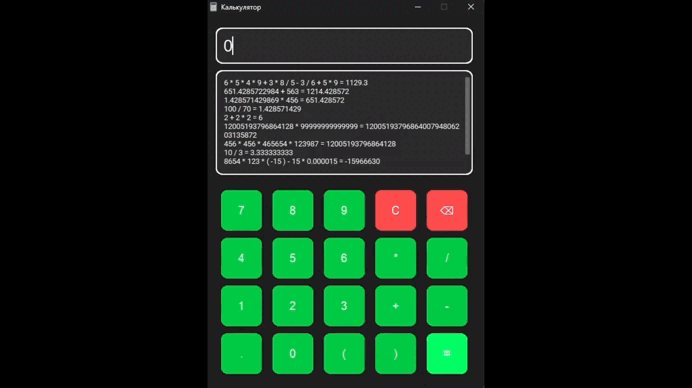

# Калькулятор на Python с CustomTkinter

## Описание
Простой калькулятор с графическим интерфейсом на Python с использованием **CustomTkinter**.  

Поддерживает:
- Ввод через при помощи мыши и клавиатуры
- Вычисление с учетом приоритетов операций
- Скобки для задания приоритетов.
- Отображение истории вычислений
- Основные арифметические операции: `+`, `-`, `*`, `/`.
- Защиту от ошибок: недопустимые выражения, двойные арифметические знаки, несколько точек в числе.
- Форматирование результатов (до 10 знаков после запятой).

## GIF-демонстрация

  

## Установка

## 1. Клонируйте репозиторий:
git clone https://github.com/Wonderwol/test_task_calculator.git
cd python-calculator

## 2. Создайте и активируйте виртуальное окружение:
python -m venv venv

### Windows
venv\Scripts\activate

### macOS/Linux
source venv/bin/activate

## 3. Установите зависимости:
pip install -r requirements.txt

## 4. Запуск
python calculator.py

